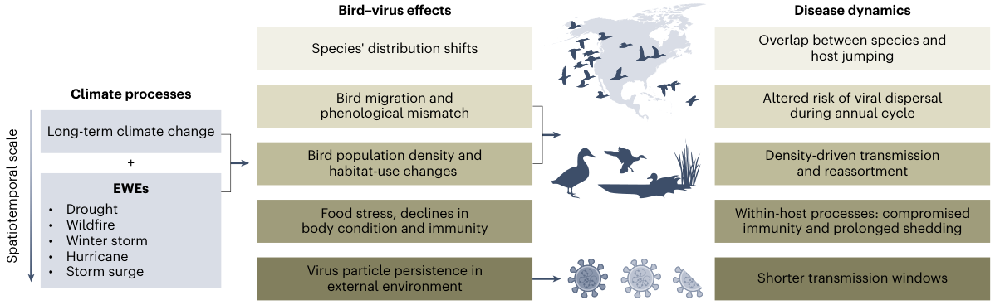

<!-- Both language drafts supplied by the author. The Chinese copy is embedded
     from assets/i18n/zh.json during the build. Publication date: 2026-09-29. -->

::: {.post-article}

<time datetime="2026-09-29">September 29, 2026</time>

::: {.post-opening}
Climate change and highly pathogenic avian influenza (HPAI) are often discussed as separate global challenges, but they increasingly intersect through the ecology of wild birds. In our 2023 Comment article, we asked how long-term climate change and short-term extreme weather events could influence HPAI not only by changing where birds move, but also by altering host population dynamics, individual physiology and immunity, and how long influenza viruses persist in the environment \[1\].

The goal was not to argue for one simple climate-to-disease pathway. Instead, we proposed a multiscale framework for thinking about how climate, bird ecology and virus dynamics can interact, sometimes in reinforcing ways and sometimes in opposite directions.
:::

## Climate change acts at more than one scale {#climate-scales}

Long-term climate change can gradually alter temperature, precipitation, sea level, vegetation and water conditions. At the same time, extreme weather events such as droughts, wildfires, winter storms, hurricanes and storm surges can produce much faster ecological responses. Together, these processes can shift species distributions, migration timing, population density, habitat use, body condition and virus persistence outside the host \[1\].

## When bird movements change, virus pathways can change {#movement-virus-pathways}

Many important avian influenza hosts, including waterfowl, shorebirds and gulls, are migratory. Their movements connect breeding, stopover and wintering areas, creating routes along which viruses can disperse. Climate-driven shifts in migration timing or species ranges can therefore create new contacts between populations that previously overlapped less, or remove contacts that once occurred regularly \[1\].

For example, warming can shift wintering ranges poleward and advance spring migration. Extreme weather can also cause birds to abandon territories, form new mixed flocks, or move into human-modified habitats. Reduced snow cover can make agricultural fields accessible for longer periods and may even reduce the need for some populations to migrate, potentially increasing contact at the wildlife-agriculture interface. None of these changes automatically means higher HPAI risk. The direction of the effect depends on which species move, where they go, how densely they aggregate, and which populations they encounter \[1\].

Several major HPAI expansion events have also coincided with unusual weather conditions, including severe cold or major storms. These temporal coincidences do not demonstrate that the weather events caused the viral expansions, but they highlight why rapid, weather-driven changes in bird movement deserve closer study.

## Climate can affect both the host and the virus {#climate-host-virus}

Movement is only one part of the framework. Climate can also change host populations. Earlier migration and longer breeding seasons could increase reproductive success in some populations, producing more immunologically naive juveniles and potentially more opportunities for transmission. In other cases, a mismatch between migration timing and food availability can reduce reproductive success or population size, which could lower transmission opportunities \[1\].

At the individual level, food limitation, migration, reproduction and extreme weather all affect energetic condition. Birds in poor condition may have weaker immune responses, potentially allowing longer viral replication, greater shedding or more severe disease. Conversely, shorter or less energetically demanding migrations could improve a bird's ability to control infection. These mechanisms remain difficult to predict because climate can affect physiology and infection in multiple, interacting ways \[1\].

The virus itself also responds to environmental conditions. Influenza particles generally persist less well in warmer, drier or more saline conditions, whereas rainfall and flooding can expand the amount of standing water available for environmental transmission, while also potentially diluting virus concentrations. Extreme temperatures and repeated freeze-thaw cycles may further alter virus stability. Climate change can therefore change both where hosts encounter one another and how long infectious virus remains available outside them \[1\].

## What do we need to understand next? {#questions-next}

We highlighted three broad questions. First, how will changing contacts among bird populations alter viral reassortment, cross-species transmission and evolution? Second, how will birds' physiological responses to climate change and extreme weather affect infection within individual hosts? Third, how will changing temperature, water conditions and other environmental factors alter virus persistence and transmission outside the host? \[1\]

Answering these questions requires combining approaches that are often studied separately: GPS tracking and biologging, remote sensing and climate data, field surveillance, laboratory infection studies, genomic and other molecular tools, and ecological modeling. The same framework also needs to cross national and disciplinary boundaries because migratory birds, viruses and weather systems do not remain within administrative borders.

## Following a changing bird-virus system {#changing-bird-virus-system}

The broader message is that climate change does more than move birds north or change the timing of migration. It can reorganize the ecological system in which HPAI circulates, from the physiology of an individual bird to the connectivity of entire flyways and the persistence of virus in water and other environments. Understanding future HPAI risk therefore requires following the birds, the virus and the changing environment together \[1\].

## Related publication {.post-references #climate-related-publication}

\[1\] Prosser, D. J., Teitelbaum, C. S., Yin, S., Hill, N. J., & Xiao, X. (2023). Climate change impacts on bird migration and highly pathogenic avian influenza. Nature Microbiology, 8, 2223-2225. doi: [10.1038/s41564-023-01538-0](https://doi.org/10.1038/s41564-023-01538-0)

<a href="posts.html">Back to posts</a>

:::
